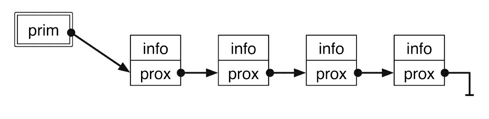
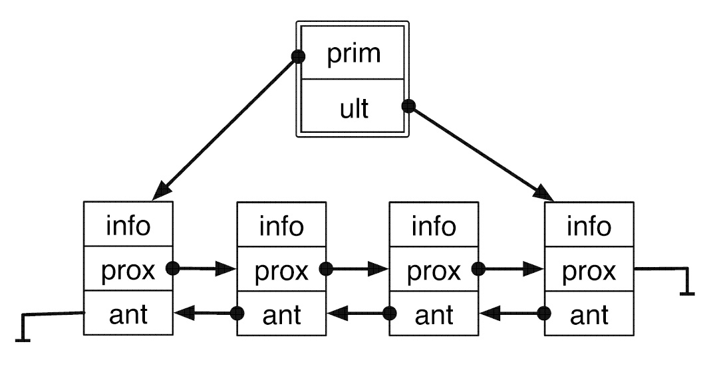

<h1 align="center"> Listas Encadeadas</h1>

Para representar um conjunto de dados, a gente sabe que podemos usar um vetor. O vetor é a forma mais primitiva de representar diversos elementos agrupados. Ao declarar um vetor, reservamos um espaço contíguo de memória para armazenar seus elementos. Este fato nos permite acessar qualquer um de seus elementos a partir do ponteiro para o primeiro elemento. Dizemos que o vetor é uma estrutura que possibilita o acesso randômico aos elementos, pois podemos acessar qualquer elemento diretamente. No entanto, o vetor não é uma estrutura de dados muito flexível, pois precisamos dimensioná-lo com um número máximo de elementos. O uso de vetores dinâmicos, através de realocação da memória, ameniza o problema, mas não necessariamente é uma solução em todas as situações, pois o custo computacional para realocar um vetor é alto.

A alternativa consiste em utilizar estruturas de dados que cresçam à medida que precisamos armazenar novos elementos (e diminuam à medida que precisamos retirar elementos armazenados anteriormente). Estas estruturas dinâmicas fazem uma alocação de memória para cada novo elemento armazenado.
Ponto importante, as listas encadeadas são amplamente usadas para implementar diversas outras estruturas de dados com semânticas próprias.

<h2 align="center"> Lista Simplesmente Encadeada</h2>

Numa lista encadeada, para cada novo elemento inserido na estrutura, alocamos um espaço de memória para armazená-lo. Desta forma, o espaço total de memória gasto pela estrutura é proporcional ao número de elementos nela armazenado. No entanto, não podemos garantir que os elementos armazenados na lista ocuparão um espaço de memória contíguo; portanto, não temos acesso direto aos elementos da lista. Para que seja possível acessar todos os elementos da lista, devemos explicitamente guardar o encadeamento dos elementos, o que é feito armazenando-se, junto com a informação, um ponteiro para o próximo elemento (ou nó) da lista.

A estrutura consiste numa sequência encadeada de elementos, em geral chamados de _nós da lista_. Um nó da lista é representado por uma estrutura que contém, conceitualmente, dois campos: a informação armazenada e o ponteiro para o próximo elemento da lista. A partir do primeiro nó, podemos alcançar o segundo seguindo o encadeamento e assim por diante. O último nó da lista armazena, como próximo nó, um ponteiro inválido, com valor NULL , sinalizando que não existe um próximo nó. A lista em si, portanto, deve ser representada por um ponteiro para o primeiro nó.

<h2 align="center"> Lista Dublamente Encadeada</h2>

Na estrutura de lista encadeada não temos como percorrer eficientemente os elementos em ordem inversa, isto é, do final para o início da lista. Além disso, encadeamento simples também dificulta a retirada de um elemento da lista. Mesmo se tivermos o ponteiro do elemento que desejamos retirar, temos que percorrer a lista, elemento por elemento, para encontrar o elemento anterior, pois, dado o ponteiro para determinado elemento, não temos como acessar diretamente seu elemento anterior.

Para solucionar esses problemas, podemos formar o que se chama de listas duplamente encadeadas. Nelas, cada elemento tem um ponteiro para o próximo elemento e um ponteiro para o elemento anterior. Desta forma, dado um elemento, podemos acessar ambos os elementos adjacentes: o próximo e o anterior. Se tivermos um ponteiro para o último elemento da lista, podemos percorrer a lista em ordem inversa, bastando acessar continuamente o elemento anterior, até alcançar o primeiro elemento da lista, que não tem elemento anterior (o ponteiro do elemento anterior vale NULL ).

